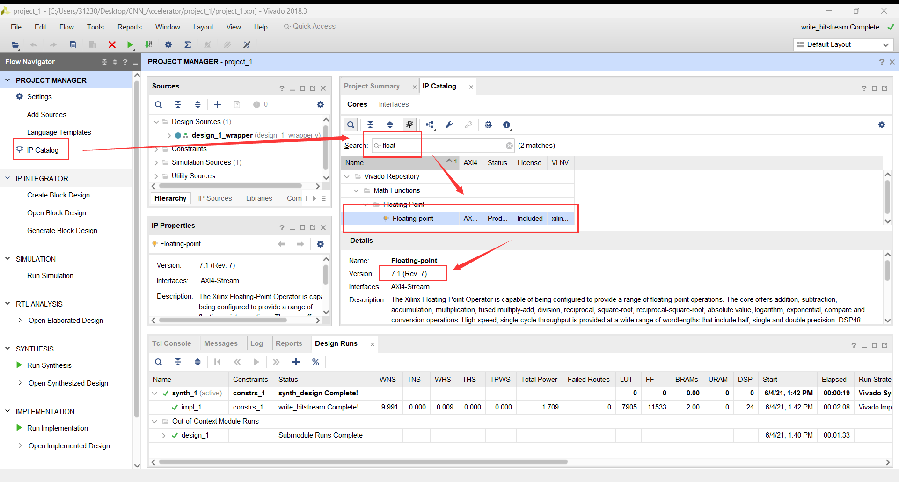

# Debug手册

## 1.Vitis HLS生成IP核过程中报错

错误提示信息：

```
ERROR: [IMPL 213-28] Failed to generate IP.
command 'ap_source' returned error code
    while executing
"source D:/HLS_Project/conv_name/solution1/export.tcl"
    invoked from within
"hls::main D:/HLS_Project/conv_name/solution1/export.tcl"
    ("uplevel" body line 1)
    invoked from within
"uplevel 1 hls::main {*}$args"
    (procedure "hls_proc" line 5)
    invoked from within
"hls_proc $argv"  conv_name:solution1  2024年6月6日 下午10:19:44
```

错误截图：

<center></center>
<center>图1 生成IP核报错</center>

产生的原因：Xilinx官方没想到2024年还有人在用2018.3......图1中的2406062219实际上是(20)24年06月06日22时19分。

解决办法：修改笔记本的系统日期至`2021`年左右即可。

## 2.Synthesis生成比特流时报错

错误提示信息：

```
[DRC INBB-3] Black Box Instances: Cell 'design_1_i/Pool_0/inst/Pool_fcmp_32ns_32eOg_U4/Pool_ap_fcmp_0_no_dsp_32_u/U0' of type 'design_1_Pool_0_0_design_1_Pool_0_0_design_1_Pool_0_0_design_1_Pool_0_0_floating_point_v7_1_7' has undefined contents and is considered a black box.  The contents of this cell must be defined for opt_design to complete successfully.
```

错误截图：

<center></center>
<center>图2 生成IP核报错</center>

产生的原因：Vivado版本不匹配导致的。实际上Pool这一IP核中使用了Vivado自带的Floating-point IP核，用于浮点数加减乘除运算。而不同版本的Vivado中，内置的Floating-point版本不同，如下图所示，所以会出现找不到文件的情况。

<center></center>
<center>图3 不同版本Vivado对应的Floating-point版本</center>

解决办法：

有两种办法，分别是：

- 使用2018.3版本的Vivado
- 修改Pool IP核中使用的Floating-point IP核版本

下面给出修改Pool的步骤。

​	首先需要查看当前Vivado使用的Floating-point版本。在主界面右侧选中 IP Catalog，然后搜索Floating-point，查看对应的IP核的版本。如图4所示，笔者当前使用的软件（Vivado2018.3）中，Floating-point的版本为v7.1.7。

<center></center>
<center>图4 查看Floating-point版本</center>

​	在查阅到版本之后，我们把Pool中的Floating-point版本全修改为匹配版本。打开`~/pool/hdl/ip`文件夹，可以看到如下四个`.hdl`文件。

<center></center>
<center>图5 Pool中使用的Floating-point IP核</center>

​	用VS Code或其他文本编辑器打开这些文件，把其中所有的`floating_point_v7_1_7`修改为对应的版本。一般而言，只需要修改最后一位数字即可。例如，根据图3，2018.2使用的是Rev.6，只需要全修改为`floating_point_v7_1_6`即可。

<center></center>
<center>图6 建议使用VS Code中的[更改所有匹配项]功能</center>

