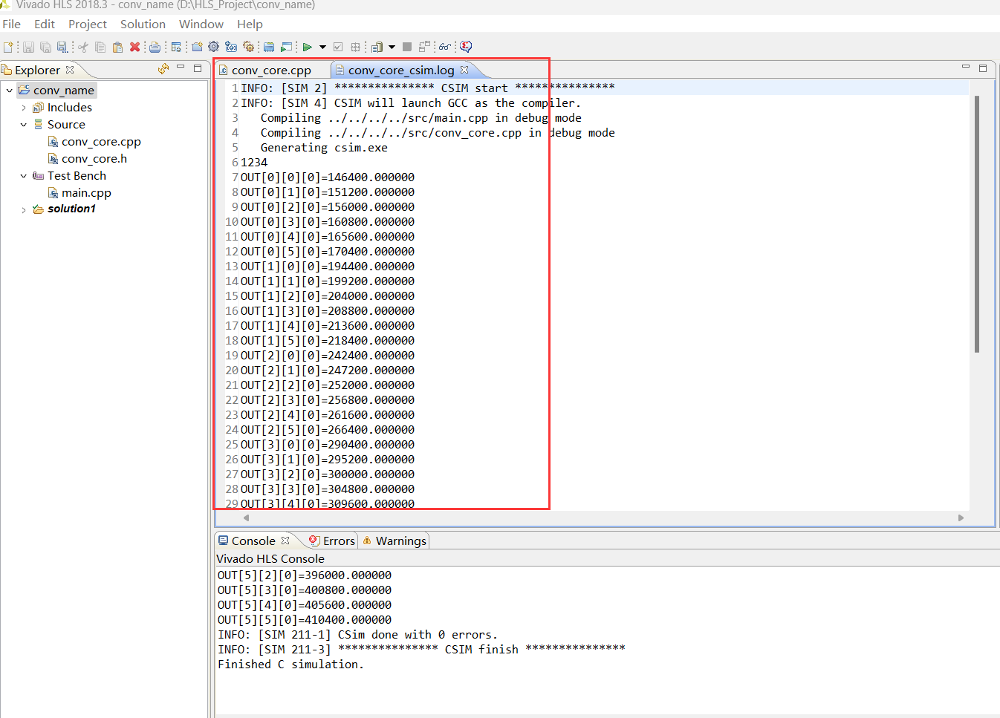

# Vivado HLS综合生成IP核

在这一步骤，你需要：

- conv_core.cpp
- conv_core.h

- main.cpp

这三个文件均可以在[src文件夹](../../src/step1)中找到。前两个文件用于生成IP核，最后一个文件用于验证正确性。

你将得到：

- IP_Core.zip

即用于卷积操作的IP核。如果你实在懒得去做实验，也可以在[这里](../../projects/Vivado" "HLS/out)直接找到该文件。

## 步骤

### 1.1 创建Vivado HLS项目

​	在桌面双击Vivado HLS快捷方式，或在开始菜单->Xilinx Design Tools->Vivado HLS打开Vivado HLS工具。点击“Quick Start”下方的“Create New Project”，或点击菜单栏中的File->New Project。然后，填写项目名称，并选择项目所在的路径，如图1-1所示。

图1-1 创建Vivado HLS项目

​	点击Next，进入源文件添加窗口。在Top Function一栏内填写`conv_core`，作为顶层函数名，如图1-2所示。

图1-2 填写Top Function名

​	点击Next，进入Test Bench的测试源文件添加窗口。此时暂不添加，继续点击Next，进入项目配置窗口。点击Part Selection线框内部的“…”按钮，打开器件选择窗口。如图1-3所示。

图1-3 设置芯片型号

​	输入`xc7z010clg400-1`，即我们板子的FPGA型号，然后点击“OK”按钮，

图1-4 选择芯片型号

​	点击“Finish”按钮，完成项目的创建，进入主界面，如图1-5所示。

图1-5 Vitis HLS主界面

​	Vivado HLS主界面主要包括6个部分：1）菜单栏和工具条。菜单栏和普通的IDE差不多，尤其接近Eclipse，这是因为Vivado HLS就是基于Eclipse开发的。工具栏包含了常用的功能按钮，如综合、仿真、打包IP核等。2）视图切换按钮，用于在Debug、综合和分析3个视图之间切换。3）项目管理窗口，用于管理项目源文件、测试源文件、IP核压缩包等文件。4）工作区：用于编辑源码和调试。5）控制台和报错信息窗口：用于查看报错信息和串口输出等。6）Outline窗口：用于显示项目相关的信息，包括顶层函数输入输出变量所对应的硬件模块的接口信号总线协议等。

### 1.2 添加源文件

​	将所提供的`conv_core.cpp`、`conv_core.h`和`main.cpp`三个源文件拷贝至工程目录下。然后在项目管理窗口的Source图标处右键，选择Add File，选择刚才拷贝的除`main.cpp`之外的源文件，如图1-6所示。

图1-6 添加源文件

​	双击Source下的源文件。可编辑其代码，如图1-7所示。

图1-7 查看或编辑源代码

​	类似地，在Test Bench图标处右键添加`main.cpp`，如图1-8所示。

图1-8 添加测试源文件

### 1.3 C代码仿真/CSIM

​	点击Project->Run C Simulation或工具条中的CSim按钮，如图1-9所示。

图1-9 点击进行CSim

​	点击CSim后，直接在弹出的窗口中点击“OK”按钮以开始C语言仿真。CSim是纯软件的仿真，仅用于验证代码功能的正确性。

&emsp;&emsp;CSim完毕后，工作区将弹出一个名为`conv_core_csim.log`的CSim日志文件以便查看仿真结果，也可在控制台窗口查看源码的编译过程及相应的测试结果，如图1-10所示。

图1-10 查看CSim结果

### 1.4 C代码调试（非必要）

​	如果CSim时不能通过测试，则需要对代码进行debug。Vivado HLS工具的调试方法和Eclipse基本一致。

&emsp;&emsp;点击CSim按钮，在弹出的窗口中勾选Launch Debugger，如图1-11所示。

图1-11 开始debug

&emsp;&emsp;点击“OK”按钮，将自动进入跟Eclipse一样的Debug视图。可在代码行数的左侧空白处双击以添加断点，如图1-12所示。

图1-12 添加断点

&emsp;&emsp;点击工具条中的Step Into(F5)或Step Over(F6)按钮，开始debug。此时，可在右上方的Variable窗口查看变量的值，如图1-13所示。

图1-13 debug时查看变量的值

&emsp;&emsp;debug完成后，点击图1-13左上角形如红色正方形的按钮，或用快捷键Ctrl+F2结束调试。此时，再点击图1-13右上角的Synthesis按钮，回到图1-5所示的主界面/综合界面。

### 1.5 综合/Synthesis

​	综合前，需要为`conv_core`项目添加Directive/原语，以指定顶层模块所对应的硬件模块的IO信号所使用的总线协议、综合时所使用的并行优化策略（如流水线、循环展开）等。

&emsp;&emsp;Directive的添加有2种方法。第一种方法是通过图形化界面添加。添加时，需要在Outline窗口处点击打开Directive标签页，并在相应的函数上右键添加Directive，如图1-14所示。

图1-14 用图形化界面添加Directive

&emsp;&emsp;第二种方法是直接在代码中插入形如`#pragma HLS xxx`的制导语句，如图1-15所示。

图1-15 直接在代码中添加Directive

!!! hint "小提示 :bulb:"
    &emsp;&emsp;在图1-15中，每一个制导语句都指定了一个端口的总线类型、主从属性以及允许的最大数据深度等信息。例如，第一行指定了`feature_out`将作为AXI总线的从端口，且最大深度为4294967295。

&emsp;&emsp;接着，可用同样的方法设置并行优化策略。

!!! info "补充说明 :mega:"
    &emsp;&emsp;此处暂不添加优化语句。在后续的实验中，将会再讲解如何优化。

&emsp;&emsp;Directive设置完毕，接下来需要对C代码进行综合，以生成RTL电路。

&emsp;&emsp;点击Project->Project Settings->Synthesis，点击Top Function右边的Browse，选择`conv_core`作为Top Function，点击“OK”按钮，如图1-16所示。

图1-16 选择Top Function

&emsp;&emsp;点击菜单栏的Solution->Run C Synthesis->Active Solution，或点击工具栏中形如绿色三角形的综合按钮，如图1-17所示。

图1-17 点击以进行综合

&emsp;&emsp;综合完成后会自动显示综合报告。报告中包含了预估性能、预估资源情况、电路时延、模块接口等信息，如图1-18所示。

图1-18 综合报告

### 1.6 C/RTL协同仿真（非必要）

​	运行C/RTL Co-Sim时，会调用HDL仿真工具。

&emsp;&emsp;点击Solution->Run C/RTL Cosimluation，或点击工具条中形如对号的按钮，如图1-19所示。

图1-19 点击进行C/RTL联合仿真

&emsp;&emsp;在弹出的窗口中选中仿真工具为Vivado Simulator，语言选中Verilog，Dump Trace选择all，如图1-20所示。

图1-20 联合仿真设置

&emsp;&emsp;仿真报告显示了仿真的结果以及时延等信息，如图1-21所示。

图1-21 联合仿真报告

&emsp;&emsp;还可点击工具条中的波形按钮以查看波形，此时将打开Vivado的仿真波形界面，如图1-22所示。

图1-22 查看仿真波形

### 1.7 导出RTL并打包成IP核/Export RTL

​	点击菜单栏的Solution->Export RTL，或点击工具条中形如棕色箱子的按钮，如图1-23所示。

图1-23 点击以导出RTL

&emsp;&emsp;随后将弹出导出IP核的设置窗口，保持默认即可，点击“OK”按钮。

&emsp;&emsp;IP核导出成功后，可在主界面/综合界面左侧的工程目录Solution1->impl->ip中找到.zip格式的IP核，如图1-24所示。

图1-24 查看导出的IP核

